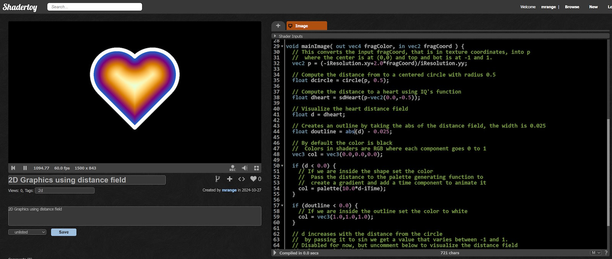
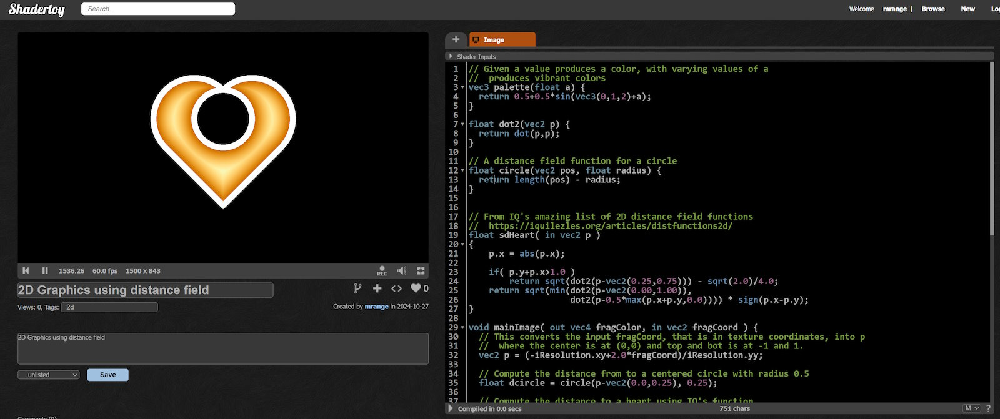

# 🎄⭐🎉 Introduction to 2D Shaders 🎉⭐🎄

🎅 Ho, ho, ho! Merry Christmas! 🎅

## Introduction

Most examples on [ShaderToy](https://www.shadertoy.com/) use complex 3D raymarching, but creating cool shaders in 2D is just as fun! Working in 2D lets us easily visualize distance fields—a common pattern in shader coding. While 3D raytracing with distance fields can be complex, understanding them in 2D can help build skills for 3D later on.

## Drawing a 2D Circle Using Shaders

[ShaderToy](https://www.shadertoy.com/) shaders are fragment shaders. A fragment shader is just a function that takes a coordinate and returns a color. A distance field function, on the other hand, returns the distance from any given point to a shape.

Here’s an example of a circle distance field:

```glsl
float circle(vec2 pos, float radius) {
  return length(pos) - radius;
}
```

In this function:
- Any point farther from the origin (`pos`) than `radius` gives a positive value.
- Points within `radius` give a negative value.
- Points exactly at `radius` give zero.

To draw a circle, we pass each coordinate to this function. If the result is negative (inside the circle), we color it white; otherwise, it’s black.

## Let’s Code It!

Head over to [ShaderToy](https://www.shadertoy.com/new) and replace the default code with this:

```glsl
// A distance field function for a circle
float circle(vec2 pos, float radius) {
  return length(pos) - radius;
}


void mainImage( out vec4 fragColor, in vec2 fragCoord ) {
  // This converts the input fragCoord, that is in texture coordinates, into p
  //  where the center is at (0,0) and top and bot is at -1 and 1.
  vec2 p = (-iResolution.xy+2.0*fragCoord)/iResolution.yy;

  // Compute the distance from to a centered circle with radius 0.5
  float dcircle = circle(p, 0.5);

  // By default the color is black
  //  Colors in shaders are RGB where each component goes 0 to 1
  vec3 col = vec3(0.0,0.0,0.0);

  if (dcircle < 0.0) {
    // If we are inside the shape set the color to white
    col = vec3(1.0,1.0,1.0);
  }

  // Set the output color with alpha = 1
  fragColor = vec4(col,1.0);
}
```

Hit Alt-Enter or click the ▶️Play button at the bottom of the source editor to compile the shader and with some luck it looks a bit like below.


## Visualizing the distance field

I mentioned it's easy to visualize the distance field in 2D and we can that by adding a red component to the color that depends on the distance.

Insert the following lines just above the comment `Set the output color with alpha = 1`

```glsl
// dcircle increases with the distance from the circle
//  by passing it to sin we get a value that varies between -1 and 1.
col.x += sin(100.*dcircle);
```


We can now see the distance field surrounding the circle but this technique works for any distance field so let's replace it with something more interesting.

Creating a good distance field function that you can use as a building block can be tricky but luckily IQ has created [a list of 2D distance field functions](https://iquilezles.org/articles/distfunctions2d/) (licensed under MIT).

I picked the heart function `sdHeart` and modified the code to visualize its distance field. I don't really understand how `sdHeart` works internally but the "contract" is that it returns the distance to the shape just as the `circle` does it.

```glsl
float dot2(vec2 p) {
  return dot(p,p);
}

// A distance field function for a circle
float circle(vec2 pos, float radius) {
  return length(pos) - radius;
}


// From IQ's amazing list of 2D distance field functions
//  https://iquilezles.org/articles/distfunctions2d/
float sdHeart( in vec2 p )
{
    p.x = abs(p.x);

    if( p.y+p.x>1.0 )
        return sqrt(dot2(p-vec2(0.25,0.75))) - sqrt(2.0)/4.0;
    return sqrt(min(dot2(p-vec2(0.00,1.00)),
                    dot2(p-0.5*max(p.x+p.y,0.0)))) * sign(p.x-p.y);
}

void mainImage( out vec4 fragColor, in vec2 fragCoord ) {
  // This converts the input fragCoord, that is in texture coordinates, into p
  //  where the center is at (0,0) and top and bot is at -1 and 1.
  vec2 p = (-iResolution.xy+2.0*fragCoord)/iResolution.yy;

  // Compute the distance from to a centered circle with radius 0.5
  float dcircle = circle(p, 0.5);

  // Compute the distance to a heart using IQ's function
  float dheart = sdHeart(p-vec2(0.0,-0.5));

  // Visualize the heart distance field
  float d = dheart;

  // By default the color is black
  //  Colors in shaders are RGB where each component goes 0 to 1
  vec3 col = vec3(0.0,0.0,0.0);

  if (d < 0.0) {
    // If we are inside the shape set the color to white
    col = vec3(1.0,1.0,1.0);
  }

  // d increases with the distance from the circle
  //  by passing it to sin we get a value that varies between -1 and 1.
  col.x += sin(100.*d);


  // Set the output color with alpha = 1
  fragColor = vec4(col,1.0);
}
```


More interesting already! We can see that distance field inside and outside follows the heart shape.

## Adding a bit of color

We can use the distance field to colorize the shapes and I am going to use a very popular palette generating function to do so:

```glsl
// Given a value produces a color, with varying values of a
//  produces vibrant colors
vec3 palette(float a) {
  return 0.5+0.5*sin(vec3(0,1,2)+a);
}
```

I then use this function to set the color:
```glsl
  if (d < 0.0) {
    // If we are inside the circle set the color
    //  Pass the distance to the palette generating function to
    //  create a gradient and add a time component to animate it
    col = palette(10.0*d-iTime);
  }
```

Finally, the output color is supposed to be in sRGB and we are in linear RGB I do an approxiamative conversion like so:

```glsl
  // Approxiamative linear RGB => RGB conversion
  col = sqrt(clamp(col,0.0,1.0));
```

The full example looks like this
```glsl
// Given a value produces a color, with varying values of a
//  produces vibrant colors
vec3 palette(float a) {
  return 0.5+0.5*sin(vec3(0,1,2)+a);
}

float dot2(vec2 p) {
  return dot(p,p);
}

// A distance field function for a circle
float circle(vec2 pos, float radius) {
  return length(pos) - radius;
}


// From IQ's amazing list of 2D distance field functions
//  https://iquilezles.org/articles/distfunctions2d/
float sdHeart( in vec2 p )
{
    p.x = abs(p.x);

    if( p.y+p.x>1.0 )
        return sqrt(dot2(p-vec2(0.25,0.75))) - sqrt(2.0)/4.0;
    return sqrt(min(dot2(p-vec2(0.00,1.00)),
                    dot2(p-0.5*max(p.x+p.y,0.0)))) * sign(p.x-p.y);
}

void mainImage( out vec4 fragColor, in vec2 fragCoord ) {
  // This converts the input fragCoord, that is in texture coordinates, into p
  //  where the center is at (0,0) and top and bot is at -1 and 1.
  vec2 p = (-iResolution.xy+2.0*fragCoord)/iResolution.yy;

  // Compute the distance from to a centered circle with radius 0.5
  float dcircle = circle(p, 0.5);

  // Compute the distance to a heart using IQ's function
  float dheart = sdHeart(p-vec2(0.0,-0.5));

  // Visualize the heart distance field
  float d = dheart;

  // By default the color is black
  //  Colors in shaders are RGB where each component goes 0 to 1
  vec3 col = vec3(0.0,0.0,0.0);

  if (d < 0.0) {
    // If we are inside the circle set the color
    //  Pass the distance to the palette generating function to
    //  create a gradient and add a time component to animate it
    col = palette(10.0*d-iTime);
  }

  // d increases with the distance from the circle
  //  by passing it to sin we get a value that varies between -1 and 1.
  // Disabled for now, but uncomment below to visualize the distance field
  // col.x += sin(100.*d);

  // Approxiamative linear RGB => RGB conversion
  col = sqrt(clamp(col,0.0,1.0));

  // Set the output color with alpha = 1
  fragColor = vec4(col,1.0);
}
```

The interior of the heart should now be a vibrant animated color gradient.

## Adding an outline

Distance fields are powerful as you can create inner glow, outer glow, shadows and outlines trivially.

For example in order to add a white outline to the heart we create a distance field for the outline based on the distance field for the shape.

```glsl
  // Creates an outline by taking the abs of the distance field, the width is 0.025
  float doutline = abs(d) - 0.025;
```

Then we use this distance field to compute the color:

```glsl
  // After we set the color of the inside of the shape
  if (doutline < 0.0) {
    // If we are inside the outline set the color to white
    col = vec3(1.0,1.0,1.0);
  }
```

That's it! That's almost too simple to believe!

The full example:
```glsl
// Given a value produces a color, with varying values of a
//  produces vibrant colors
vec3 palette(float a) {
  return 0.5+0.5*sin(vec3(0,1,2)+a);
}

float dot2(vec2 p) {
  return dot(p,p);
}

// A distance field function for a circle
float circle(vec2 pos, float radius) {
  return length(pos) - radius;
}


// From IQ's amazing list of 2D distance field functions
//  https://iquilezles.org/articles/distfunctions2d/
float sdHeart( in vec2 p )
{
    p.x = abs(p.x);

    if( p.y+p.x>1.0 )
        return sqrt(dot2(p-vec2(0.25,0.75))) - sqrt(2.0)/4.0;
    return sqrt(min(dot2(p-vec2(0.00,1.00)),
                    dot2(p-0.5*max(p.x+p.y,0.0)))) * sign(p.x-p.y);
}

void mainImage( out vec4 fragColor, in vec2 fragCoord ) {
  // This converts the input fragCoord, that is in texture coordinates, into p
  //  where the center is at (0,0) and top and bot is at -1 and 1.
  vec2 p = (-iResolution.xy+2.0*fragCoord)/iResolution.yy;

  // Compute the distance from to a centered circle with radius 0.5
  float dcircle = circle(p, 0.5);

  // Compute the distance to a heart using IQ's function
  float dheart = sdHeart(p-vec2(0.0,-0.5));

  // Visualize the heart distance field
  float d = dheart;

  // Creates an outline by taking the abs of the distance field, the width is 0.025
  float doutline = abs(d) - 0.025;

  // By default the color is black
  //  Colors in shaders are RGB where each component goes 0 to 1
  vec3 col = vec3(0.0,0.0,0.0);

  if (d < 0.0) {
    // If we are inside the shape set the color
    //  Pass the distance to the palette generating function to
    //  create a gradient and add a time component to animate it
    col = palette(10.0*d-iTime);
  }

  if (doutline < 0.0) {
    // If we are inside the outline set the color to white
    col = vec3(1.0,1.0,1.0);
  }

  // d increases with the distance from the circle
  //  by passing it to sin we get a value that varies between -1 and 1.
  // Disabled for now, but uncomment below to visualize the distance field
  // col.x += sin(100.*d);

  // Approxiamative linear RGB => RGB conversion
  col = sqrt(clamp(col,0.0,1.0));

  // Set the output color with alpha = 1
  fragColor = vec4(col,1.0);
}
```

How it hopefully looks to you:



## Combining the cirle and heart shape

One of the most amazing things with distance fields is how easy it is to combine them.

I want to show the circle and the heart at the same time and in order to do so I need to combine the two distance field into a single one.

I do this by replace the code:
```glsl
  float d = dheart;
```

with:
```glsl
  // Ends up looking a bit like Mickey Mouse
  float d = min(dheart,dcircle);
```

This creates a kind of Mickey Mouse looking shape. Hopefully we won't get sued by Disney!

The `min` function produces the union of two distance fields, the `max` function produces the intersection of two distance fields.


```glsl
  // Ends up looking a bit like Google Map pin
  float d = max(dheart,dcircle);
```

By turning the circle in and out (by negating it) with can create a hole in the heart (presumably where cupid shot its arrow?). Tinkered abit with circle distance field to make it fit better, made the radius 0.25 and moved the circle center to (0.0,0.25).

```glsl
  // Compute the distance from to a centered circle with radius 0.5
  float dcircle = circle(p-vec2(0.0,0.25), 0.25);

  // Compute the distance to a heart using IQ's function
  float dheart = sdHeart(p-vec2(0.0,-0.5));

  // A hole-y heart
  float d = max(dheart,-dcircle);
```

The full example:

```glsl
// Given a value produces a color, with varying values of a
//  produces vibrant colors
vec3 palette(float a) {
  return 0.5+0.5*sin(vec3(0,1,2)+a);
}

float dot2(vec2 p) {
  return dot(p,p);
}

// A distance field function for a circle
float circle(vec2 pos, float radius) {
  return length(pos) - radius;
}


// From IQ's amazing list of 2D distance field functions
//  https://iquilezles.org/articles/distfunctions2d/
float sdHeart( in vec2 p )
{
    p.x = abs(p.x);

    if( p.y+p.x>1.0 )
        return sqrt(dot2(p-vec2(0.25,0.75))) - sqrt(2.0)/4.0;
    return sqrt(min(dot2(p-vec2(0.00,1.00)),
                    dot2(p-0.5*max(p.x+p.y,0.0)))) * sign(p.x-p.y);
}

void mainImage( out vec4 fragColor, in vec2 fragCoord ) {
  // This converts the input fragCoord, that is in texture coordinates, into p
  //  where the center is at (0,0) and top and bot is at -1 and 1.
  vec2 p = (-iResolution.xy+2.0*fragCoord)/iResolution.yy;

  // Compute the distance from to a centered circle with radius 0.5
  float dcircle = circle(p-vec2(0.0,0.25), 0.25);

  // Compute the distance to a heart using IQ's function
  float dheart = sdHeart(p-vec2(0.0,-0.5));

  // A hole-y heart
  float d = max(dheart,-dcircle);

  // Creates an outline by taking the abs of the distance field, the width is 0.025
  float doutline = abs(d) - 0.025;

  // By default the color is black
  //  Colors in shaders are RGB where each component goes 0 to 1
  vec3 col = vec3(0.0,0.0,0.0);

  if (d < 0.0) {
    // If we are inside the shape set the color
    //  Pass the distance to the palette generating function to
    //  create a gradient and add a time component to animate it
    col = palette(10.0*d-iTime);
  }

  if (doutline < 0.0) {
    // If we are inside the outline set the color to white
    col = vec3(1.0,1.0,1.0);
  }

  // d increases with the distance from the circle
  //  by passing it to sin we get a value that varies between -1 and 1.
  // Disabled for now, but uncomment below to visualize the distance field
  // col.x += sin(100.*d);

  // Approxiamative linear RGB => RGB conversion
  col = sqrt(clamp(col,0.0,1.0));

  // Set the output color with alpha = 1
  fragColor = vec4(col,1.0);
}
```

And how it should look to you:


## That's all I wanted to show today

Distance fields are a very commmon and powerful pattern used in many shaders in one way or another. I think it's important to develop an inituition for how they work and how you can combine them.

While central for 3D raymarchers I found developing the intiution in 3D difficult and I had greater success on working with 2D graphics and apply the knowledge I got from it to 3D.

You can do cool stuff in 2D by utilizing the distance field to create various effects and in my example I used `min` and `max` to combine shapes but there are other ways to do for example `soft-min` and `soft-max`.

To keep my examples conceptually simple I didn't apply any anti-aliasing techniques to make the edges smooth. It's not a difficult one-liner but I thought it is better to leave this for another time.


✨🎄🎁A merry and jolly Christmas to you all!🎁🎄✨


🎅 - mrange

## ❄️Licensing Information❄️

All code content I created for this blog post is licensed under [CC0](https://creativecommons.org/public-domain/cc0/) (effectively public domain). Any code snippets from other developers retain their original licenses.

The text content of this blog is licensed under [CC BY-SA 4.0](https://creativecommons.org/licenses/by-sa/4.0/) (the same license as Stack Overflow).