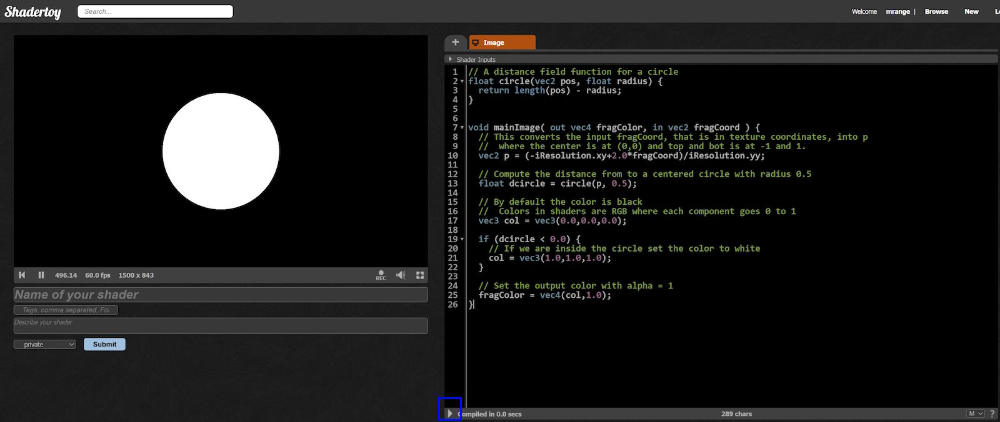
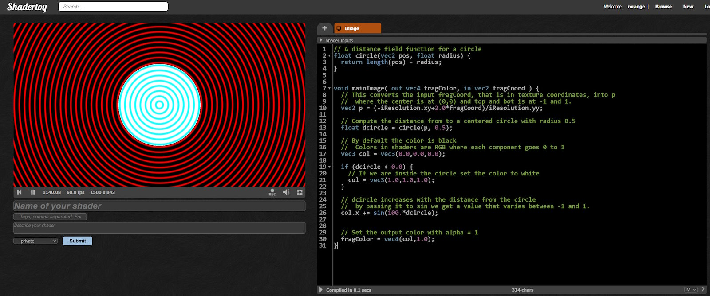
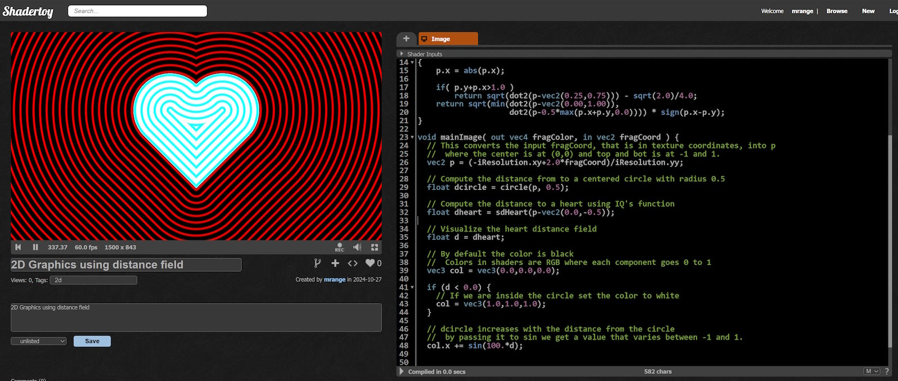

# 🎄⭐🎉Introduction to 2D shaders🎉⭐🎄

🎅Ho, ho, ho! Merry Christmas!🎅

## Introduction

While most examples on [ShaderToy](https://www.shadertoy.com/) are 3D raymarchers you can do cool shaders with 2D. In addition, doing 2D it's easy to visualize distance fields which is a very common pattern in shader coding.

Distance fields are often used in shader raytracers but it's tricky to visualize the distance field in 3D. We can learn alot about how distance fields works by studying them in 2D and then apply our kwowledge to 3D.

## Drawing a 2D circle

As mentioned in the introductory post for [Shader Advent 2024](../intro/README.md) a fragment shader is just a function that takes a coordinate and returns a color and a distance field function when given a point returns the distance from the point to the surface.

A simple circle distance field function can look like this

```glsl
float circle(vec2 pos, float radius) {
  return length(pos) - radius;
}
```

Each point further from origo than `radius` will result in a positive value, each point inside `radius` will result in a negative value and all points at `radius` will result in 0.

In order to draw a circle we will pass the coordinate to the circle distance field function and for each point that is inside, that is results in a negative value we wil set the color to white, otherwise it's black.

Now [create a shader in ShaderToy](https://www.shadertoy.com/new) and replace the code with:

```glsl
// A distance field function for a circle
float circle(vec2 pos, float radius) {
  return length(pos) - radius;
}


void mainImage( out vec4 fragColor, in vec2 fragCoord ) {
  // This converts the input fragCoord, that is in texture coordinates, into p
  //  where the center is at (0,0) and top and bot is at -1 and 1.
  vec2 p = (-iResolution.xy+2.0*fragCoord)/iResolution.yy;

  // Compute the distance from to a centered circle with radius 0.5
  float dcircle = circle(p, 0.5);

  // By default the color is black
  //  Colors in shaders are RGB where each component goes 0 to 1
  vec3 col = vec3(0.0,0.0,0.0);

  if (dcircle < 0.0) {
    // If we are inside the circle set the color to white
    col = vec3(1.0,1.0,1.0);
  }

  // Set the output color with alpha = 1
  fragColor = vec4(col,1.0);
}
```

Hit Alt-Enter or click the ▶️Play button at the bottom of the source editor to compile the shader and with some luck it looks a bit like below.



## Visualizing the distance field

I mentioned it's easy to visualize the distance field in 2D and we can that by adding a red component to the color that depends on the distance.

Insert the following lines just above the comment `Set the output color with alpha = 1`

```glsl
// dcircle increases with the distance from the circle
//  by passing it to sin we get a value that varies between -1 and 1.
col.x += sin(100.*dcircle);
```



We can now see the distance field surrounding the circle but this technique works for any distance field so let's replace it with something more interesting.

Creating a good distance field function that you can use as a building block can be tricky but luckily IQ has created [a list of 2D distance field functions](https://iquilezles.org/articles/distfunctions2d/) (licensed under MIT).

I picked the heart function `sdHeart` and modified the code to visualize its distance field. I don't really understand how `sdHeart` works internally but the "contract" is that it returns the distance to the shape just as the `circle` does it.

```glsl
float dot2(vec2 p) {
  return dot(p,p);
}

// A distance field function for a circle
float circle(vec2 pos, float radius) {
  return length(pos) - radius;
}


// From IQ's amazing list of 2D distance field functions
//  https://iquilezles.org/articles/distfunctions2d/
float sdHeart( in vec2 p )
{
    p.x = abs(p.x);

    if( p.y+p.x>1.0 )
        return sqrt(dot2(p-vec2(0.25,0.75))) - sqrt(2.0)/4.0;
    return sqrt(min(dot2(p-vec2(0.00,1.00)),
                    dot2(p-0.5*max(p.x+p.y,0.0)))) * sign(p.x-p.y);
}

void mainImage( out vec4 fragColor, in vec2 fragCoord ) {
  // This converts the input fragCoord, that is in texture coordinates, into p
  //  where the center is at (0,0) and top and bot is at -1 and 1.
  vec2 p = (-iResolution.xy+2.0*fragCoord)/iResolution.yy;

  // Compute the distance from to a centered circle with radius 0.5
  float dcircle = circle(p, 0.5);

  // Compute the distance to a heart using IQ's function
  float dheart = sdHeart(p-vec2(0.0,-0.5));

  // Visualize the heart distance field
  float d = dheart;

  // By default the color is black
  //  Colors in shaders are RGB where each component goes 0 to 1
  vec3 col = vec3(0.0,0.0,0.0);

  if (d < 0.0) {
    // If we are inside the circle set the color to white
    col = vec3(1.0,1.0,1.0);
  }

  // d increases with the distance from the circle
  //  by passing it to sin we get a value that varies between -1 and 1.
  col.x += sin(100.*d);


  // Set the output color with alpha = 1
  fragColor = vec4(col,1.0);
}
```



More interesting already! We can see that distance field inside and outside follows the heart shape.

## Adding a bit of color to it

We can use the distance field to colorize the shapes and I am going to use a very popular palette generating function to do so:

```glsl
// Given a value produces a color, with varying values of a
//  produces vibrant colors
vec3 palette(float a) {
  return 0.5+0.5*sin(vec3(0,1,2)+a);
}
```

I then use this function to set the color:
```glsl
  if (d < 0.0) {
    // If we are inside the circle set the color
    //  Pass the distance to the palette generating function to
    //  create a gradient and add a time component to animate it
    col = palette(10.0*d-iTime);
  }
```

Finally, the output color is supposed to be in sRGB and we are in linear RGB I do an approxiamative conversion like so:

```glsl
  // Approxiamative linear RGB => RGB conversion
  col = sqrt(clamp(col,0.0,1.0));
```

The full example looks like this
```glsl
// Given a value produces a color, with varying values of a
//  produces vibrant colors
vec3 palette(float a) {
  return 0.5+0.5*sin(vec3(0,1,2)+a);
}

float dot2(vec2 p) {
  return dot(p,p);
}

// A distance field function for a circle
float circle(vec2 pos, float radius) {
  return length(pos) - radius;
}


// From IQ's amazing list of 2D distance field functions
//  https://iquilezles.org/articles/distfunctions2d/
float sdHeart( in vec2 p )
{
    p.x = abs(p.x);

    if( p.y+p.x>1.0 )
        return sqrt(dot2(p-vec2(0.25,0.75))) - sqrt(2.0)/4.0;
    return sqrt(min(dot2(p-vec2(0.00,1.00)),
                    dot2(p-0.5*max(p.x+p.y,0.0)))) * sign(p.x-p.y);
}

void mainImage( out vec4 fragColor, in vec2 fragCoord ) {
  // This converts the input fragCoord, that is in texture coordinates, into p
  //  where the center is at (0,0) and top and bot is at -1 and 1.
  vec2 p = (-iResolution.xy+2.0*fragCoord)/iResolution.yy;

  // Compute the distance from to a centered circle with radius 0.5
  float dcircle = circle(p, 0.5);

  // Compute the distance to a heart using IQ's function
  float dheart = sdHeart(p-vec2(0.0,-0.5));

  // Visualize the heart distance field
  float d = dheart;

  // By default the color is black
  //  Colors in shaders are RGB where each component goes 0 to 1
  vec3 col = vec3(0.0,0.0,0.0);

  if (d < 0.0) {
    // If we are inside the circle set the color
    //  Pass the distance to the palette generating function to
    //  create a gradient and add a time component to animate it
    col = palette(10.0*d-iTime);
  }

  // d increases with the distance from the circle
  //  by passing it to sin we get a value that varies between -1 and 1.
  // Disabled for now, but uncomment below to visualize the distance field
  // col.x += sin(100.*d);

  // Approxiamative linear RGB => RGB conversion
  col = sqrt(clamp(col,0.0,1.0));

  // Set the output color with alpha = 1
  fragColor = vec4(col,1.0);
}
```

The interior of the heart should now be a vibrant animated color gradient.

🎅 - mrange

## ❄️Licensing Information❄️

All code content I created for this blog post is licensed under [CC0](https://creativecommons.org/public-domain/cc0/) (effectively public domain). Any code snippets from other developers retain their original licenses.

The text content of this blog is licensed under [CC BY-SA 4.0](https://creativecommons.org/licenses/by-sa/4.0/) (the same license as Stack Overflow).