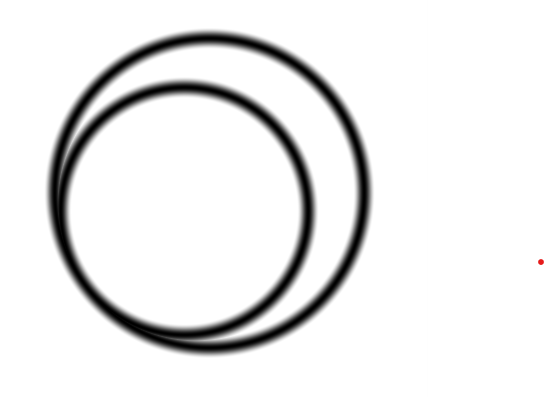
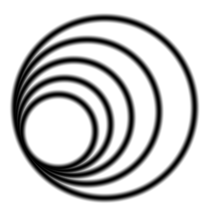

# Circles of light

Ho ho, shader friends! Today I will tell you my christmas story about circles. Circles that starts out very ordinary and then turn into magic circles of light. But let's not get ahead of ourselfs. The story began by me, accepting to write an article about shader coding. Me? Was that really a good idea considering my lack of experience in the field. Time went by and not much happend other than the deadline coming closer. One evening I did a lazy search for shader tutorials on youtube and I found *An introduction to Shader Art Coding* by Kishimisu. Wow! Starting out with simple circles, Kishimisu used clever tricks to transform the plain circles into magic. Maybe I could do that as well but in my own style?

## The basic idea

It turns out that it is very simple to draw a circle using a shader. In fact drawing any 2D shape is simple if we have a function that return the distance from any point in the plane to the shape. And calculating the distance to a circle is trivial.

```glsl
void mainImage( out vec4 fragColor, in vec2 fragCoord )
{
    vec2 uv = (fragCoord * 2.0 - iResolution.xy) / iResolution.y;    
    vec2 center = vec2(0.0,0.0);
    float radius = 0.7;
    float dist = smoothstep(0.0, 0.05, abs(length(uv + center) - radius));    
        
    fragColor = vec4(dist, dist, dist, 1.0);
}
```


A single circle is not interesting enough though but what about a circles that contains other circles? 

If $r_n$ is the radius of the outer circle and $c_n$ is the center we can calculate get a smaller circle by multiplying by a number less than one, for example 0.8.

$r_{n+1} = r_{n} * 0.8$

If we want the inner circle to touch the outer, the new center will be

$c_{n+1} = c_n + (r_{n} - r_{n+1}) \times [cos(\alpha), sin(\alpha)]$

where $\alpha$ is the rotation of the inner circle around the center of the outer. Let's try that out.

```glsl
void mainImage( out vec4 fragColor, in vec2 fragCoord )
{
    vec2 uv = (fragCoord * 2.0 - iResolution.xy) / iResolution.y;    
    
    float r_0 = 0.7;
    vec2 c_0 = vec2(0.0,0.0);
    float dist_0 = smoothstep(0.0, 0.05, abs(length(uv + c_0) - r_0));    

    float r_1 = r_0 * 0.8;
    float alpha = 3.14/5.0;
    vec2 c_1 = c_0 + (r_0 - r_1) * vec2(cos(alpha), sin(alpha));
    float  dist_1 = smoothstep(0.0, 0.05, abs(length(uv + c_1) - r_1));    

    float dist = min(dist_0, dist_1);  // combine result
    fragColor = vec4(dist, dist, dist, 1.0);
}
```




Using a for loop we can create as many as we want.

```glsl
void mainImage( out vec4 fragColor, in vec2 fragCoord )
{
    vec2 uv = (fragCoord * 2.0 - iResolution.xy) / iResolution.y;    
    
    float ro = 0.8;
    vec2 co = vec2(0.0,0.0);
    float dist = smoothstep(0.0, 0.05, abs(length(uv + co) - ro));    
    
    for(float i=1.0; i<5.0; i++)
    {        
        float ri = ro * 0.8;
        float alpha = 3.15 / 15.0 * i;
        vec2 ci = co + (ro - ri) * vec2(cos(alpha), sin(alpha));
        float disti = smoothstep(0.0, 0.05, abs(length(uv + ci) - ri));    
        dist = min(disti, dist);
        
        ro = ri;
        co = ci;
    }
    
    fragColor = vec4(dist, dist, dist, 1.0);
}
```



It is easy to animate by letting $\alpha$ vary by time.

```glsl
float alpha = 3.15 / 15.0 * i * iTime;
```
