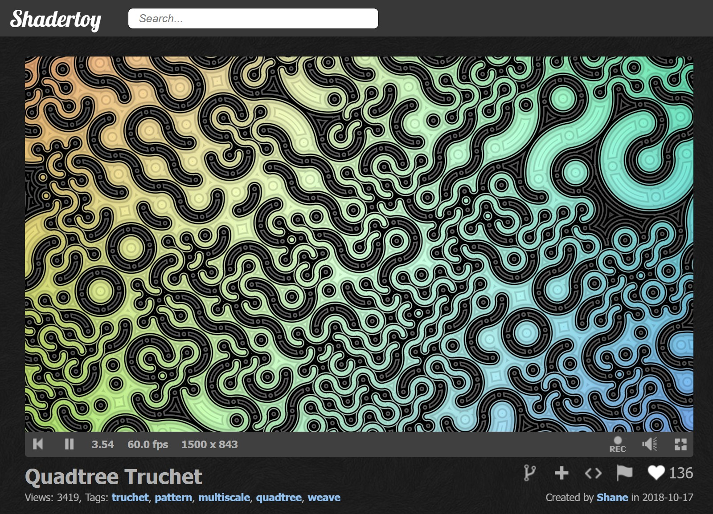
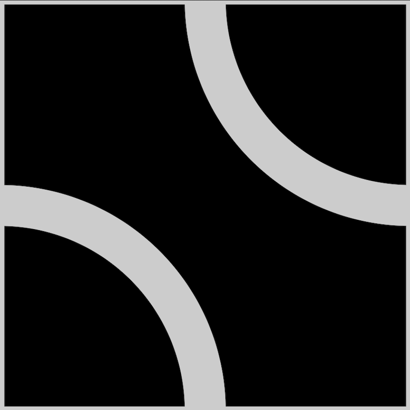
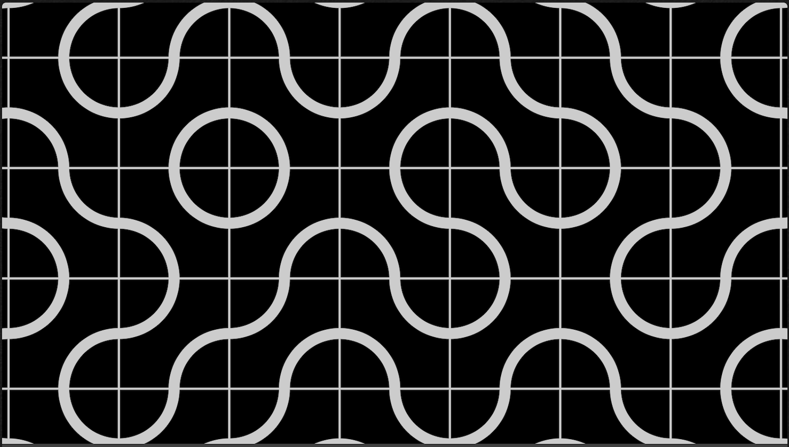
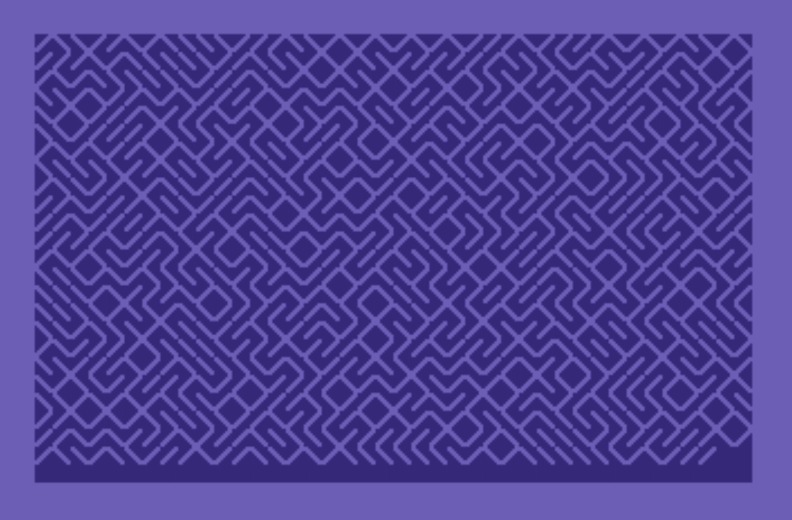
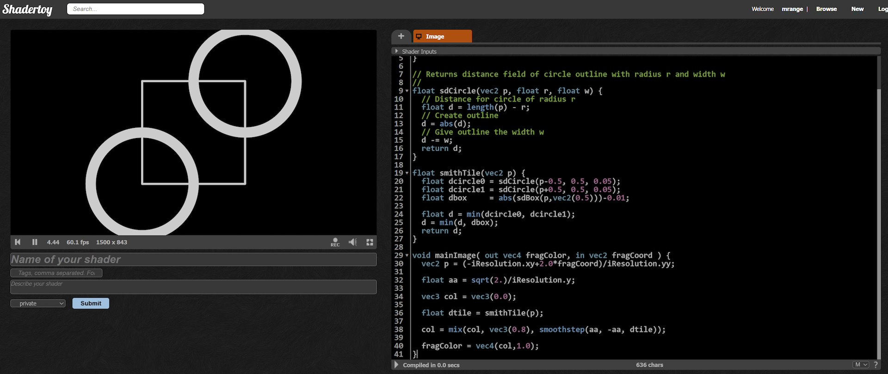
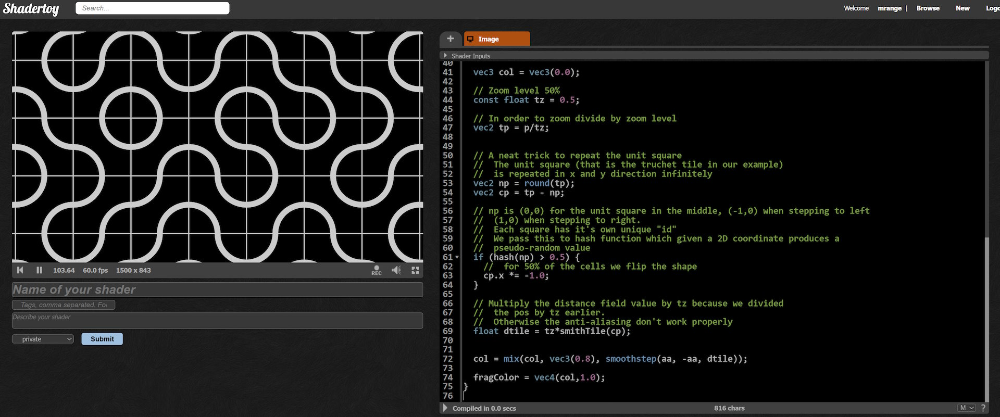
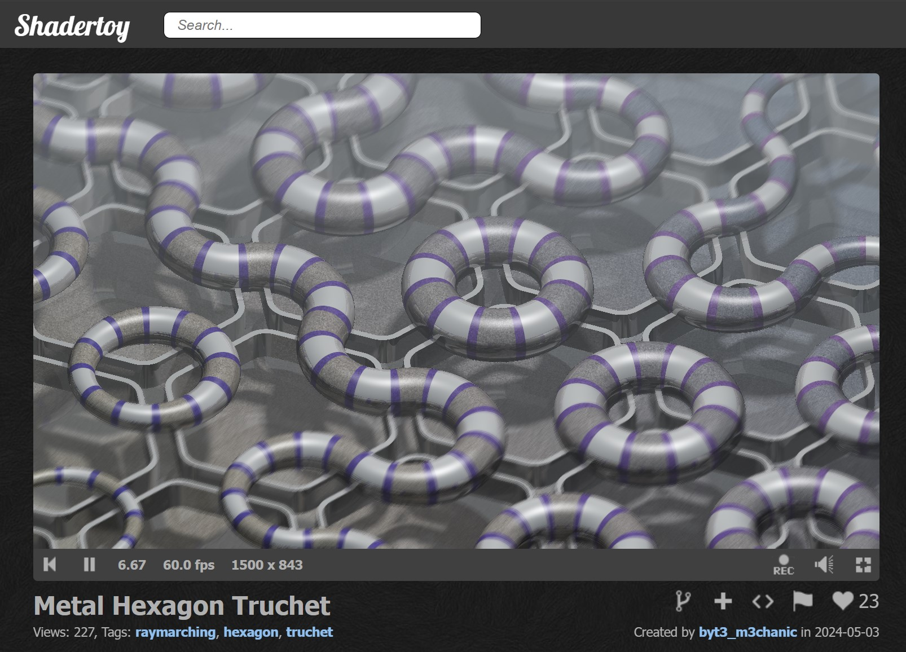

# 🎄⭐🎉 Truchet Shaders: A Festive Dive into Patterns 🎉⭐🎄

🎅 *Merry Code-mas, shader fans!* 🎅

## 🎄 Why Truchet Patterns Are So Cool 🎄



Truchet patterns—or [Truchet tiles](https://en.wikipedia.org/wiki/Truchet_tiles)—are a gift that keeps on giving! With just a single tile, arranged randomly, you can create intricate, surprising designs.

Take the classic *Smith tile*, for example:
<p align="center">
  
</p>

This tile is simple: it fits with itself, no matter how you rotate it. Fill a whole grid with random rotations of the Smith tile, and suddenly, you’ve got an endlessly fascinating pattern:


For some retro flair, there’s even the classic C64 trick that randomly fills the screen with slashes (`\`) and backslashes (`/`), creating an unexpected maze-like effect.

```basic
10 PRINT CHR$(205.5+RND(1));
20 GOTO 10
```

Try this on a C64 emulator for instant retro vibes!


## So, How Do We Make a Shader Out of This?

Step one: [create a new ShaderToy shader](https://www.shadertoy.com/new).

Let’s start simple by making a Smith tile in GLSL. Think of each tile as a square (side = 1), with two circles centered in opposite corners, each with a radius of 0.5. Throw in a border square, and voilà: you’ve got your base tile!

We start by defining the helper functions the box and circle:
```glsl
// Found here: https://iquilezles.org/articles/distfunctions2d/
float sdBox( in vec2 p, in vec2 b ) {
    vec2 d = abs(p)-b;
    return length(max(d,0.0)) + min(max(d.x,d.y),0.0);
}

// Returns distance field of circle outline with radius r and width w
//
float sdCircle(vec2 p, float r, float w) {
  // Distance for circle of radius r
  float d = length(p) - r;
  // Create outline
  d = abs(d);
  // Give outline the width w
  d -= w;
  return d;
}
```

Using these functions we can now define the smith tile:

```glsl
float smithTile(vec2 p) {
  float dcircle0 = sdCircle(p-0.5, 0.5, 0.05);
  float dcircle1 = sdCircle(p+0.5, 0.5, 0.05);
  float dbox     = abs(sdBox(p,vec2(0.5)))-0.01;

  // Combines the distance fields using the union operation (min)
  float d = min(dcircle0, dcircle1);
  d = min(d, dbox);
  return d;
}

```

Here is the complete example:
```glsl
// Found here: https://iquilezles.org/articles/distfunctions2d/
float sdBox( in vec2 p, in vec2 b ) {
    vec2 d = abs(p)-b;
    return length(max(d,0.0)) + min(max(d.x,d.y),0.0);
}

// Returns distance field of circle outline with radius r and width w
//
float sdCircle(vec2 p, float r, float w) {
  // Distance for circle of radius r
  float d = length(p) - r;
  // Create outline
  d = abs(d);
  // Give outline the width w
  d -= w;
  return d;
}

float smithTile(vec2 p) {
  float dcircle0 = sdCircle(p-0.5, 0.5, 0.05);
  float dcircle1 = sdCircle(p+0.5, 0.5, 0.05);
  float dbox     = abs(sdBox(p,vec2(0.5)))-0.01;

  float d = min(dcircle0, dcircle1);
  d = min(d, dbox);
  return d;
}

void mainImage( out vec4 fragColor, in vec2 fragCoord ) {
  vec2 p = (-iResolution.xy+2.0*fragCoord)/iResolution.yy;

  float aa = sqrt(2.)/iResolution.y;

  vec3 col = vec3(0.0);

  float dtile = smithTile(p);

  col = mix(col, vec3(0.8), smoothstep(aa, -aa, dtile));

  fragColor = vec4(col,1.0);
}
```



To smooth out those sharp pixel edges, I use a little trick with `smoothstep` to blend the foreground and background colors nicely. By estimating the pixel size as `float aa = sqrt(2.)/iResolution.y;`, we can set up `smoothstep(aa, -aa, dtile)` to gradually shift from one color to another as the distance field `dtile` moves from inside (negative) to outside (positive) the tile. This keeps the borders smooth and anti-aliased—a handy technique I come back to again and again.

## Infinite Tiles, Minimal Effort 🎄

One of the joys of shaders? You can often repeat an object endlessly at almost no extra cost! This concept, called domain repetition, lets us create a seamless, infinite grid of Truchet tiles with just a few lines of code. One simple way of repeating the unit square is this simple code:

```glsl
vec2 tp = p;
// A neat trick to repeat the unit square
//  The unit square (that is the truchet tile in our example)
//  is repeated in x and y direction infinitely
vec2 np = round(tp);
vec2 cp = tp - np;

float dtile = smithTile(cp);
```

Applying simple domain repetition to the Smith tile creates a wavy, hypnotic pattern. It’s nice, but we can spice it up by adding a dash of pseudo-randomness! To do that, we’ll introduce a `hash` function that randomizes the rotation of each tile, creating a much richer and more dynamic pattern.

```glsl
// Produces a pseudo-random from a 2D point
float hash(vec2 co) {
  return fract(sin(dot(co.xy ,vec2(12.9898,58.233))) * 13758.5453);
}
```

We then use `hash` to flip half of the tiles.

```glsl
vec2 cp = tp - np;

if (hash(np) > 0.5) {
  //  for 50% of the cells we flip the shape
  cp.x *= -1.0;
}

float dtile = smithTile(cp);
```

This randomization kicks things up a notch, but we’re only seeing a small section of the plane.

To explore more (or less!) of the pattern, let’s add a zoom feature that lets us scale in and out, revealing different levels of detail across the tiled plane.

```glsl
  // Zoom level 50%
  const float tz = 0.5;

  // In order to zoom divide by zoom level
  vec2 tp = p/tz;

  // ... the rest of the code from the sample

  // Multiply the distance field value by tz because we divided
  //  the pos by tz earlier.
  //  Otherwise the anti-aliasing don't work properly
  float dtile = tz*smithTile(cp);
```

You can now change `tz` to zoom in and out.

You can see the entire example below:

```glsl
// Found here: https://iquilezles.org/articles/distfunctions2d/
float sdBox( in vec2 p, in vec2 b ) {
    vec2 d = abs(p)-b;
    return length(max(d,0.0)) + min(max(d.x,d.y),0.0);
}

// Returns distance field of circle outline with radius r and width w
//
float sdCircle(vec2 p, float r, float w) {
  // Distance for circle of radius r
  float d = length(p) - r;
  // Create outline
  d = abs(d);
  // Give outline the width w
  d -= w;
  return d;
}

float smithTile(vec2 p) {
  float dcircle0 = sdCircle(p-0.5, 0.5, 0.05);
  float dcircle1 = sdCircle(p+0.5, 0.5, 0.05);
  float dbox     = abs(sdBox(p,vec2(0.5)))-0.01;

  float d = min(dcircle0, dcircle1);
  d = min(d, dbox);
  return d;
}


// Produces a pseudo-random from a 2D point
float hash(vec2 co) {
  return fract(sin(dot(co.xy ,vec2(12.9898,58.233))) * 13758.5453);
}


void mainImage( out vec4 fragColor, in vec2 fragCoord ) {
  vec2 p = (-iResolution.xy+2.0*fragCoord)/iResolution.yy;

  float aa = sqrt(2.)/iResolution.y;

  vec3 col = vec3(0.0);

  // Zoom level 50%
  const float tz = 0.5;

  // In order to zoom divide by zoom level
  vec2 tp = p/tz;


  // A neat trick to repeat the unit square
  //  The unit square (that is the truchet tile in our example)
  //  is repeated in x and y direction infinitely
  vec2 np = round(tp);
  vec2 cp = tp - np;

  // np is (0,0) for the unit square in the middle, (-1,0) when stepping to left
  //  (1,0) when stepping to right.
  //  Each square has it's own unique "id"
  //  We pass this to hash function which given a 2D coordinate produces a
  //  pseudo-random value
  if (hash(np) > 0.5) {
    //  for 50% of the cells we flip the shape
    cp.x *= -1.0;
  }

  // Multiply the distance field value by tz because we divided
  //  the pos by tz earlier.
  //  Otherwise the anti-aliasing don't work properly
  float dtile = tz*smithTile(cp);


  col = mix(col, vec3(0.8), smoothstep(aa, -aa, dtile));

  fragColor = vec4(col,1.0);
}
```




Here’s a polished version:

With the box shape we added, the Truchet tiles are easy to spot. But if we remove the box, the pattern becomes more subtle, making the effect a bit harder to decipher.

```
float smithTile(vec2 p) {
  float dcircle0 = sdCircle(p-0.5, 0.5, 0.05);
  float dcircle1 = sdCircle(p+0.5, 0.5, 0.05);

  float d = min(dcircle0, dcircle1);
  return d;
}
```

## That’s it for today!

Truchet patterns are a fantastic way to create intriguing designs, and there are endless possibilities—even multi-layered Truchet patterns! If you’re up for some holiday shader fun, why not tinker with them yourself?

For inspiration, check out these awesome Truchet shaders by [Shane](https://www.shadertoy.com/user/Shane), like the [quadtree Truchet](https://www.shadertoy.com/view/4t3BW4) or the mesmerizing [Hyperbolic Poincare Weave](https://www.shadertoy.com/view/tljyRR). And [byt3_m3chanic](https://www.shadertoy.com/user/byt3_m3chanic) has crafted some amazing Truchet shaders too, often in 3D, like [this one](https://www.shadertoy.com/view/lcySzz).



Of course, these examples are more complex than today’s, but they build on the same core ideas—just taken to new heights.

Wishing you all…

✨🎄🎁 A festive season filled with shader magic and perhaps even a new GPU under the tree! 🎁🎄✨

🎅 - mrange

