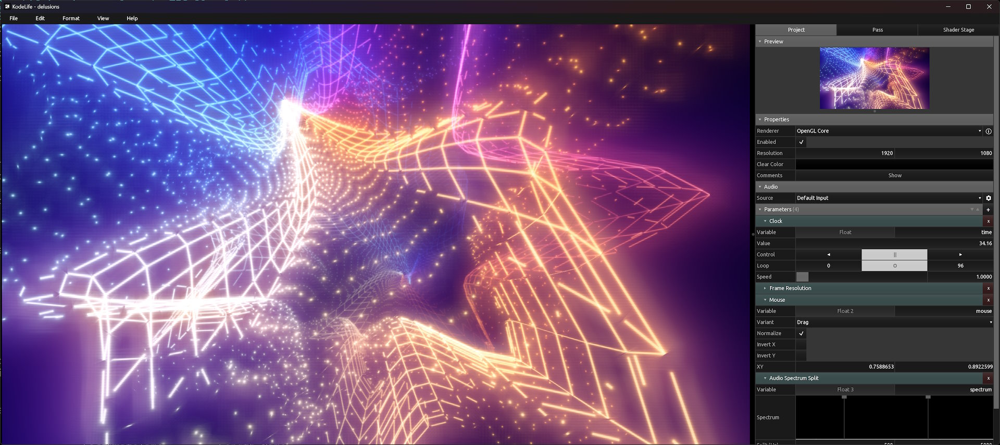
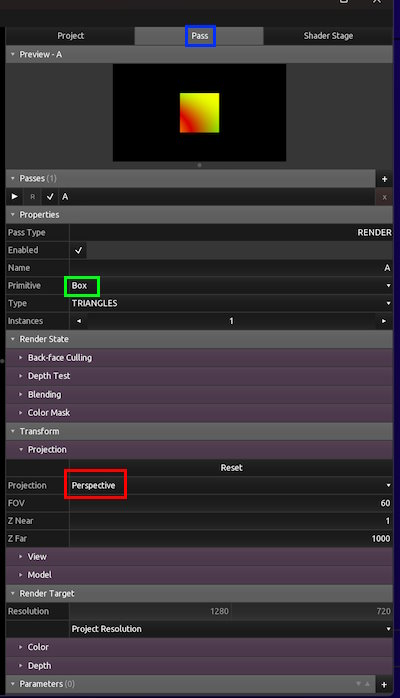
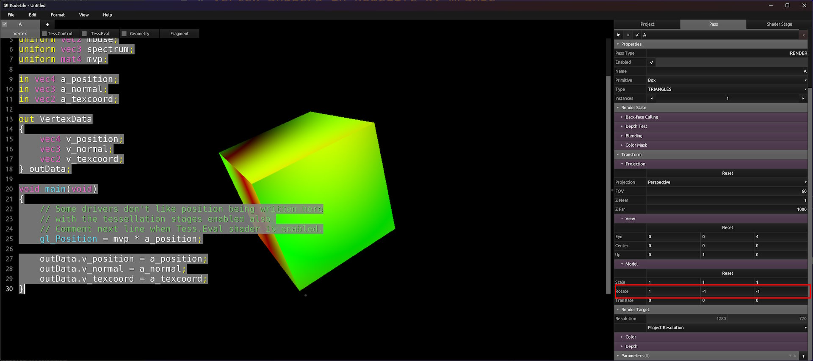
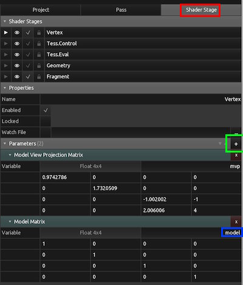
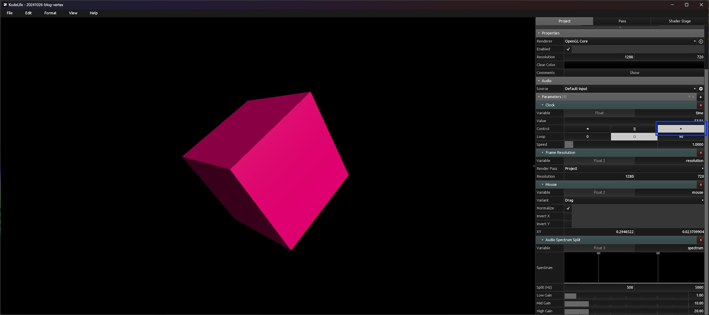
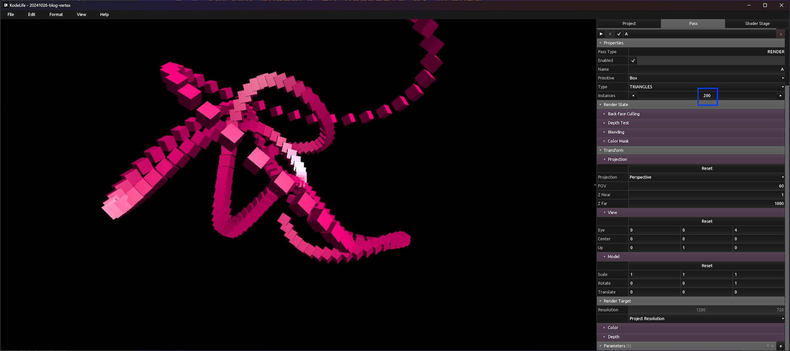

# Vertex Shaders in KodeLife by mrange

Hello.

[ShaderToy](https://www.shadertoy.com/) let's us experiment and share Fragment Shaders (or Pixel Shaders if you are using DirectX).

A less known (I think) type of shaders for shader tinkerers is Vertex Shaders. Vertex Shaders can let you do cool stuff though, especially if you combine your knowledge of fragment shaders with vertex shaders.

The 4KiB intro `Delusions of mediocrity` most of the work is in the vertex shader generating vertices using a supershape formula. The fragment shaders produced the colors and the post-process effect.


## Getting started with Vertex Shaders

The drawback with vertex shaders is that they are more complicated to utitlize than fragment shaders but I will make an attempt to explain them a bit.

I like [KodeLife by Hexler](https://hexler.net/kodelife) so I am going to use that for my examples. KodeLife can be used for free but you get a nag-screen asking you to consider buying it.

When you start KodeLife it gives you an initial setup. Normally I go directly into the fragment shader and start tinkering but for this example let's look at the vertex shader.

I have used code comments to explain what's different from a fragment shader.
```glsl
#version 150

// Uniforms are "global" variables set by the host program
//  Works the same as for fragment shaders
uniform float time;
uniform vec2 resolution;
uniform vec2 mouse;
uniform vec3 spectrum;

// One important difference from fragment shaders is that the model view
//  projection (mvp) transform is injected.
//  This allows the host program to control the rotation of the object and the
//  camera position. The projection part transforms the 3D coordinate to a
//  2D screen position.
//  The math is a bit finicky for this but luckily KodeLife sets that up for us
//  and it is easy to use
uniform mat4 mvp;

//  The position of the current vertex in the model
in vec4 a_position;
//  The normal of the current vertex in the model
in vec3 a_normal;
//  The texture coordiante of the current vertex in the model
in vec2 a_texcoord;
// These are inputs into the vertex shader and the host process has defined a
//  model whose vertexes are fed into the vertex shader
//  These are very common inputs but it is possible for the host process to
//  remove any of these are send extra data such as color of the vertex

// The output of the vertex shader, this can be read by the fragment shaders
//  to control the shading
out VertexData
{
    // The transformed position, this is not the input position sent through
    //  the MVP. Rather one approach I sometimes use is just run the in position
    //  through the model transform so that it is rotated relative to the view
    //  so I can compute the lighting in the fragment shader correctly
    vec4 v_position;
    // Same goes for the normal
    vec3 v_normal;
    // I usually pass the texture coordinate untransformed but tinkering here
    //  is possible to get cool effects.
    vec2 v_texcoord;
} outData;
// This is common outputs of the vertex shader but it is easy and common to
//  extend this with more outputs to contol the shading done by the fragment
//  shader

void main(void)
{
    // gl_Position is the 2D coordinate of the vertex
    //  therefore we pass the input position through the MVP
    //  transform. The `w` part of the `vec4` will be used for
    //  applying perspective transformation.
    gl_Position = mvp * a_position;

    // In the standard KodeLife vertex shader the input data is just forwarded
    //  to the fragment shader
    outData.v_position = a_position;
    outData.v_normal = a_normal;
    outData.v_texcoord = a_texcoord;
}
```

## First step, let's switch it up

What we see in kodelife is actually a 3D model but the reason it looks like a flat surface is that the model is a quad and the projection is orthographic.

Let's switch that. Instead we are going to use a box model (in KodeLife called Primitive) and a projection with perspective.

Switch to the Pass tab and change the Primitive to Box and the Projection to Perspective.



The causes the view to change and you should see a single square in the middle of the screen. This actually a box. This is more easily seen if you under Model in KodeLife changes some of the parameters. For example I set Rotate to (1,-1,-1) and it looks like below:



## Let's shade the cube

As a guy growing up with computers in the 1980s I love rotating cubes, in fact I believe computers are made for rotating cubes.

But let's shade the cube a bit more naturally by applying a simple fragment shader to the sides of the cube.

Replace the fragment shader with this code. This applies basic lighting to the sides of the cube. I tried explain what it does in the comments
```glsl
#version 150

uniform float time;

// This the input from the vertex shader
//  since the 2D primitive is a textured triangle
//  the input is blended between the 3 vertices
//  that makes up the triangle
//  If you desire you can ask use "flat" blending
//  so you get the value produced by the vertex shader.
in VertexData
{
    vec4 v_position;
    vec3 v_normal;
    vec2 v_texcoord;
} inData;

out vec4 fragColor;

// The direction of the light to illuminate our cube
const vec3 lightDir = normalize(vec3(1,1,2));
// The camera pos, should match the "eye" parameter in the View setting in KodeLife
//  In a real app this is likely injected as an uniform instead
const vec3 cameraPos   = vec3(0,0,4);

void main(void) {
  // Compute diffuse lighting by taking the dot product of the surface normal
  //  Classic stuff!
  float dif = max(dot(lightDir, inData.v_normal), 0);
  // Multiply with itself to give bit more metallic look
  dif *= dif;
  // Base illumination
  dif += 0.05;

  // Compute the ray direction from the eye position on the surface position in 3D
  vec3 rayDir = normalize(inData.v_position.xyz-cameraPos);
  // Now we can reflect the ray direction using it and the normal of the surface
  vec3 refDir = reflect(rayDir, inData.v_normal);
  // Given the reflected ray and the light dir we can compute the specular lighting
  //  by taking the dot product that will be closer to 1 the more the reflect ray
  //  aligns with the direction to the light
  //  To make it more "point-like" use the pow function
  float spe = pow(max(dot(lightDir, refDir), 0), 10.0);

  // Ready to compute the color
  vec3 col = vec3(0.0);
  // The diffuse color
  col += dif*vec3(1,0., 0.25);
  // The specular color
  col += spe;
  // Fake sRGB conversion
  //  Most screens are sRGB (although new screen tech liked OLED makes sRGB a bit outdated)

  //  sRGB color luminence is not linear
  //  so we need to convert our linear RGB into non-linear sRGB
  //  Which is a bit complicated, so I cheat and use sqrt as an approximation
  col = sqrt(col);

  // Finally write output fragment color
  fragColor = vec4(col, 1.0);
}
```

Now you should have a cube with pink sides but when you try to rotate it by changing the view parameters the shading of the cube doesn't change. The reason is that we don't transform the vertex positions and normal using the model transform in the vertex shader.

Let's fix that.

The model view projection transform (MVP) is 3 transforms multiplied together, the model, the view and the projection transform. We need the model transform but unfortunately we can't split the transform into its 3 parts.

However, we can ask KodeLife to add the model transform as a uniform input to our vertex shader.



First ensure you are editing the vertex shader, then click the shader stage. Under parameters click `+` to add a uniform, you find the model transform under `Built-in->Transform->Model`. Then change the name of the Model transform to `model`

Then in the vertex shader source code add the model uniform under the mvp uniform
```glsl
// Should already be in the file
uniform mat4 mvp;
// Add this line to import the model uniform
uniform mat4 model;
```

Finally modify the main method of the vertex shader into this:

```glsl
void main(void) {
  gl_Position = mvp * a_position;

  // Multiply the model and a_position to create a position transform with the model transform
  //  Note that the ordering is important as matrix multiplication is non-commuative meaning the
  //  unlike normal algebra where a*b = b*a this is not true in general for matrix algebra
  outData.v_position  = model*a_position;
  // We also need to transform the normal the same way but we change the model from mat4 into mat3
  //  to match the dimensions of the normal (vec3). We lose the translation part of the matrix
  //  that way but that makes no sense to the normals anyway and what remains is just the rotation part.
  outData.v_normal    = mat3(model)*a_normal;
  outData.v_texcoord  = a_texcoord;
}
```

The cube lighting should then react to the rotation. In order to make the lighting more pronounced try changing the Primitive from Box to Teapot or Monkey.

After you are done playing around with the different models change back to Box as now we will add time to the mix.

## Making a classic rotating cube

By using rotation matrix that depend on time we can create a classic rotating cube:

Replace the vertex shader with the code below
```glsl
#version 150

uniform float time;
uniform mat4 mvp;
uniform mat4 model;

in vec4 a_position;
in vec3 a_normal;
in vec2 a_texcoord;

out VertexData
{
    vec4 v_position;
    vec3 v_normal;
    vec2 v_texcoord;
} outData;

// In order to support time based rotations we need functions to create rotation matrix from
//  an angle
//  rotX rotates around the X axis, rotY around the Y axis and rotZ around the Z axis.

mat3 rotX(float a) {
  float c = cos(a);
  float s = sin(a);
  return mat3(
    1.0 , 0.0 , 0.0
  , 0.0 , +c  , +s
  , 0.0 , -s  , +c
  );
}

mat3 rotY(float a) {
  float c = cos(a);
  float s = sin(a);
  return mat3(
    +c  , 0.0 , +s
  , 0.0 , 1.0 , 0.0
  , -s  , 0.0 , +c
  );
}

mat3 rotZ(float a) {
  float c = cos(a);
  float s = sin(a);
  return mat3(
    +c  , +s  , 0.0
  , -s  , +c  , 0.0
  , 0.0 , 0.0 , 1.0
  );
}

void main(void) {
  // Create a rotation matrix that uses time to create an appealing (I hope)
  //  rotation
  //  We will use mat3 to rotate the normal
  mat3 trot3 = rotX(time)*rotY(sqrt(0.5)*time)*rotZ(0.3*sqrt(0.5)*time);
  // But as we also need to transform the position we need a mat4 version
  mat4 trot4 = mat4(trot3);

  // Combine mvp and our rotation matrix to transform the
  //  position into a 2D position
  gl_Position = (mvp * trot4) * a_position;

  // Combine the model and the rotation matrix to transform the position
  outData.v_position  = (model*trot4)*a_position;
  // And do the same for the normal but using mat3s
  outData.v_normal    = (mat3(model)*trot3)*a_normal;
  outData.v_texcoord  = a_texcoord;
}
```

Hopefully it looks something like this now:



You might need to hit the Play button to start the timer.

## Let's kick it up a notch

So a single rotating cube is cool but what is cooler is more than one cube, preferably a lot more.

We can do this with instancing which means that we take a single shape (like a cube) and repeats it many times but modifies the output of the vertex shader depending on the instance ID.

Replace the vertex shader with the code below:

```glsl
#version 150

uniform float time;
uniform mat4 mvp;
uniform mat4 model;

in vec4 a_position;
in vec3 a_normal;
in vec2 a_texcoord;

out VertexData
{
    vec4 v_position;
    vec3 v_normal;
    vec2 v_texcoord;
} outData;

// In order to support time based rotations we need functions to create rotation matrix from
//  an angle
//  rotX rotates around the X axis, rotY around the Y axis and rotZ around the Z axis.

mat3 rotX(float a) {
  float c = cos(a);
  float s = sin(a);
  return mat3(
    1.0 , 0.0 , 0.0
  , 0.0 , +c  , +s
  , 0.0 , -s  , +c
  );
}

mat3 rotY(float a) {
  float c = cos(a);
  float s = sin(a);
  return mat3(
    +c  , 0.0 , +s
  , 0.0 , 1.0 , 0.0
  , -s  , 0.0 , +c
  );
}

mat3 rotZ(float a) {
  float c = cos(a);
  float s = sin(a);
  return mat3(
    +c  , +s  , 0.0
  , -s  , +c  , 0.0
  , 0.0 , 0.0 , 1.0
  );
}

void main(void) {
  const float tau = acos(-1.)*2.;

  // Should match instance count in KodeLife
  const float numberOfInstances = 200;
  const float angleMul = tau*numberOfInstances/40.;
  // gl_InstanceID is an integer that is 0 for the first instance, 1 for the second and so on
  //  using this instance id we can apply different kind of transforms to the output of the vertex shader
  //  to create cool effects
  float i = float(gl_InstanceID)/numberOfInstances;
  float tm = 0.5*time;

  // Let's tweak the vertex position depending on the time and instance
  vec4 pos = a_position;
  // Some random combinations of sin and cos to produce new x,y,z coords
  pos.x += 13.*(0.25+cos(0.25*angleMul*i+tm))*sin(angleMul*i+tm);
  pos.y += 17.*(0.25+cos(0.25*angleMul*i+tm))*sin(0.25*angleMul*i+tm);
  pos.z += 19.*(0.25+cos(0.25*angleMul*i+tm))*cos(angleMul*i+tm);

  // Then we compute an angle that depends on the time and instance id and compute a rotation transform from that
  float angle = tm+i*tau*2;
  mat3 trot3 = rotX(angle)*rotY(sqrt(0.5)*angle)*rotZ(0.3*sqrt(0.5)*angle);
  mat4 trot4 = mat4(0.1*trot3);

  gl_Position = (mvp * trot4) * pos;

  outData.v_position  = (model*trot4)*pos;
  outData.v_normal    = (mat3(model)*trot3)*a_normal;
  outData.v_texcoord  = a_texcoord;
}
```

Not much happened but we need to increase the instance count in KodeLife:



Hopefully you have 200 cubes on the screen that are animated.

If you struggle getting the examples to work you can download the [KodeLife project](200_boxes.klproj)

## That's it

I hope you got a wee introduction on how to tinker with vertex shaders to create cool effects.

In order to perhaps help you along a bit more I dug around in my library of incomplete and buggy shaders and found some more KodeLife examples of vertex shaders.

The code is in the state it was when I lost interest in it so it might actually hurt you more than help you. You have been warned.

1. [mrange & Virgill - Delusions of mediocrity (Windows 4k intro)](delusions.klproj)
1. [A fractal 2D tree](2d_tree.klproj)
1. [A fractal 3D tree](falling_leaves.klproj)
1. [Tinkering with parametric 3D shapes](parametric3d.klproj)
1. [Solid Supershape](solid_supershapes.klproj)
1. [Neonwave sunset](neonwave.klproj)
1. ["Star" scroller](starscroller_variant.klproj)
1. [Underwater bubbles](bubble_bobble.klproj)

## Licensing information

All code content I created for this blog post including the linked KodeLife sample code is licensed as CC0 (basically public domain). The code I use from others developer is licensed under their original license (obviously).

The blog content itself is licensed as [CC BY-SA 4.0](https://creativecommons.org/licenses/by-sa/4.0/) (ie the StackOverflow license).


