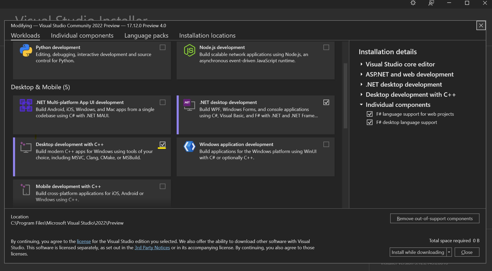

# 🎄⭐🎉 Rendering Shaders in an Windows App 🎉⭐🎄

🎅 *Merry Christmas, WebGL fans!* 🎅

Tinkering with Shaders in ShaderToy is great fun but how do we package it as a Windows App or even better a 4KiB Windows App?

There are tools out there to help you create a small executable but first you need a Windows App that renders a fragment shader.

I thought I start by showing how to create a minimal Windows App that opens a Windows and renders a fragment shader in it. Then in the follow-up blog post we will minimize it to less than 4KiB.

## The plan

1. Create Visual C++ project
2. Open a Window using Win32 (like BillG intended)
3. Initialize OpenGL
4. Compile the fragment shader
5. In the render loop draw a quad covering the entire Window with fragment shader attached.
5. Goto 4 until user hit Escape or closes the window

## Create a Visual C++ project

I am going to use [Visual Studio 2022 Community](https://visualstudio.microsoft.com/downloads/) which are free for tinkering with code.

During install make sure to install `Desktop development with C++`:



I used the template `Console App (C++)` to create the project.

You can find the project [here](wgl-1/) and get it by either cloning this repository or downloading the files, you need all files to make it work.

## Important dependencies

We need Windows headers (obviously) but also OpenGL headers

```c++
#include <windows.h>    // Core Windows functions (creating windows, handling messages)
#include <GL/gl.h>      // Core OpenGL functions
#include "glext.h"      // Modern OpenGL extensions (needed for shaders)
```

The `glext.h` contains extensions for OpenGL which we will use. This file is not provided out of the box but I included a copy in the demo project.

In addition; we need to include OpenGL code by linking `opengl32.lib`. This I setup in the demo project.

## Opening a Window

The entry point for a console application is the `main` function where I put the majority of the code.

I will walk you through the example. In order to detect errors as early as possible I added lots of `assert` to the code, these will not be included in a a Release build.

Let's start with opening the window:

The idea is this.
1. We work only with the Win32 API, this is to make sure that we later on has as little overhead as possible to make a 4KiB executable. Right now though for various reasons the executable will be much bigger than 4KiB.
2. Create a Window Class that has a certain flags set and a custom window event handler. The window event handler allows us to react on events such closing the window.
3. Using this Window class we create a window centered on the screen.

In code it looks like this:
```c++
/*
  * Step 1: Initialize Window
  */

auto hInstance = GetModuleHandle(0);
assert(hInstance && "Failed to get module handle");

// Complete the window class specification by setting the hInstance
windowClassSpecification.hInstance = hInstance;

// Register the window class with Windows. This is necessary to create a window
// instance later based on the specifications defined in `windowClassSpecification`.
auto regOk = RegisterClassA(&windowClassSpecification);
assert(regOk && "Failed to register window class");

// Define the window style with flags for visibility, overlapping, and popup behavior.
auto dwStyle = WS_VISIBLE | WS_OVERLAPPEDWINDOW | WS_POPUP;

// Adjust the window size to account for window borders and title bar based on the specified
// resolution (`xres` by `yres`). This ensures the client area matches the desired resolution.
RECT windowRect = { 0, 0, xres, yres };
auto rectOk = AdjustWindowRect(&windowRect, dwStyle, 0);
assert(rectOk && "Failed to adjust window rect");

// Calculate the dimensions of the adjusted window and find the center position
// based on the screen size, so the window will open centered on the screen.
auto width        = windowRect.right - windowRect.left;
auto height       = windowRect.bottom - windowRect.top;
auto screenWidth  = GetSystemMetrics(SM_CXSCREEN);
auto screenHeight = GetSystemMetrics(SM_CYSCREEN);

// Create the window with the specified style, dimensions, and centered position.
auto hwnd = CreateWindowExA(
    0                                       // No extended window styles
  , windowClassSpecification.lpszClassName  // Registered window class name
  , nullptr                                 // No window title
  , dwStyle                                 // Window style flags
  , (screenWidth - width) / 2               // Centered X position
  , (screenHeight - height) / 2             // Centered Y position
  , width, height                           // Window dimensions
  , nullptr, nullptr, nullptr, nullptr      // Parent, menu, instance, and param handles (unused)
);
assert(hwnd && "Failed to create window");
```

While a bit tricky to get all the configuration and parameters right the first time when it comes down to it, it's not that much code to open a Window.

## Initialize OpenGL

The graphics is going to be an OpenGL fragment shader so we need to initialize OpenGL. Luckily it's rather simple to do so.

1. Get the Device Context (needed to draw graphics in general)
2. Ask Windows for a pixel format compatible with OpenGL
3. Switch the Device Context to this pixel format

In code it looks like this:

```c++
/*
  * Step 2: Initialize OpenGL
  */

// Obtain the device context (DC) for the specified window, which allows us to draw
// and interact with the window's graphics.
auto hdc = GetDC(hwnd);
assert(hdc && "Failed to get DC");

// Set up the OpenGL pixel format for the window, specifying how pixels should be represented.
auto pixelFormat = ChoosePixelFormat(hdc, &pixelFormatSpecification);
assert(pixelFormat && "Failed to choose pixel format");

// Apply the selected pixel format to the device context, ensuring that it is properly configured
// for OpenGL rendering.
auto setOk = SetPixelFormat(hdc, pixelFormat, &pixelFormatSpecification);
assert(setOk && "Failed to set pixel format");

// Create and activate an OpenGL rendering context for the device context, which allows us
// to perform OpenGL operations in this window.
auto hglrc = wglCreateContext(hdc);
assert(hglrc && "Failed to create GL context");

// Make the created OpenGL context current for the specified device context, enabling
// OpenGL commands to affect the window's rendering.
auto makeOk = wglMakeCurrent(hdc, hglrc);
assert(makeOk && "Failed to make GL context current");
```

## Initializing the demo

This can be complex but in our case it's just to compile the fragment shader.

What we do is this:

1. Enable OpenGL debug info during Debug builds (to help us troubleshoot more easily)
2. Using the very helpful OpenGL function `glCreateShaderProgramv` we pass the fragment shader source to it and store the result as `shaderProgram`
3. Then we disable the OpenGL debug info to not interfere with us rendering the shader.
4. Create an OpenGL account for the Device Context and make it the current one.
5. Locate the uniform variables `iTime` and `iResolution` in the compiled shader, this will allow us to inject values into the shader during the render loop later.
6. Last make the shader program the current one.

One complexity is that while many functions are directly available as normal functions such as `glUseProgram` others we have to ask for by name such as `glCreateShaderProgramv`. This is because these functions are extensions that may or may not be available.

So we query by name for `glCreateShaderProgramv` and store the pointer to that function in `glCreateShaderProgramv`:

```c++
auto glCreateShaderProgramv = (PFNGLCREATESHADERPROGRAMVPROC)wglGetProcAddress("glCreateShaderProgramv");
```

Then we can calling the function by using the function pointer:
```c++
auto shaderProgram = glCreateShaderProgramv(GL_FRAGMENT_SHADER, 1, fragmentShaders);
```

This is a very common pattern in OpenGL.

In code it looks like this:

```c++
/*
  * Step 3: Set up Shader Program
  */

#ifdef _DEBUG
// Enable OpenGL debug output in debug builds
glEnable(GL_DEBUG_OUTPUT);

// Retrieve a pointer to the OpenGL function `glDebugMessageCallback` using `wglGetProcAddress`.
// OpenGL functions like this one are often not directly accessible, as they may be specific
// to certain OpenGL versions or extensions. By looking them up at runtime, we ensure compatibility
// with different graphics drivers and hardware setups.
auto glDebugMessageCallback = (PFNGLDEBUGMESSAGECALLBACKPROC)wglGetProcAddress("glDebugMessageCallback");

// Set up a debug callback function (`debugCallback`) to handle messages from the OpenGL driver,
// like errors or performance warnings. This helps with diagnosing issues during development.
glDebugMessageCallback(debugCallback, 0);
#endif

// Create the shader program using `glCreateShaderProgramv` which creates a shader
// program in one step by specifying the shader type and the shader source code. This function
// allows us to skip manual shader compilation and linking steps. We specify `GL_FRAGMENT_SHADER`
// as the shader type, with `1` indicating that there�s one shader source in `fragmentShaders`.
GLchar const* fragmentShaders[] = { GetFragmentShaderSource() };
auto glCreateShaderProgramv = (PFNGLCREATESHADERPROGRAMVPROC)wglGetProcAddress("glCreateShaderProgramv");
auto shaderProgram = glCreateShaderProgramv(GL_FRAGMENT_SHADER, 1, fragmentShaders);

// Ensure that `shaderProgram` was created successfully. A non-positive value would indicate
// a failure to create the program, so we use an assertion to catch this in debug builds.
assert(shaderProgram > 0 && "Failed to create shader program");

#ifdef _DEBUG
// Retrieve the compilation log for `shaderProgram` and print it
auto glGetProgramInfoLog = (PFNGLGETSHADERINFOLOGPROC)wglGetProcAddress("glGetProgramInfoLog");
glGetProgramInfoLog(shaderProgram, sizeof(debugLog), NULL, debugLog);
printf(debugLog);

// Final setup is complete, so disable debug output
glDisable(GL_DEBUG_OUTPUT);
#endif

auto glGetUniformLocation = (PFNGLGETUNIFORMLOCATIONPROC)wglGetProcAddress("glGetUniformLocation");
// Get the location of the `iTime` uniform in the shader program. This location will be used
// to set the value of `iTime`.
auto iTimeLocation = glGetUniformLocation(shaderProgram, "iTime");
// Get the location of the `iResolution` uniform in the shader program. This location is
// used to pass the resolution of the rendering window.
auto iResolutionLocation = glGetUniformLocation(shaderProgram, "iResolution");
assert(iTimeLocation > -1 && iResolutionLocation > -1 && "Failed to get uniform locations");

// Activate the shader program so it will be applied to all pixels
// in subsequent draw calls, such as the upcoming call to `glRects`.
auto glUseProgram = (PFNGLUSEPROGRAMPROC)wglGetProcAddress("glUseProgram");
glUseProgram(shaderProgram);
```
## The render loop

Finally we are ready to start the render loop.

1. Capture the initial time (in milliseconds). We will use it to compute `iTime` later.
2. Loop until `done` is true.
3. Process the events Windows send to use, to make sure our window react on resize events and other events. If the `WM_QUIT` event is received set `done` to true.
4. Compute `iTime` as the different between current time and initial time.
5. Use the current `xres` and `yres` as `iResolution`
6. Inject the `iTime` and `iResolution` values into the shader by setting the uniforms.
7. Render a quad (rectangle) that covers the entire window.

In code it looks like this:
```c++
/*
  * Step 4: Main Render Loop
  */

// Start time (in milliseconds)
auto before = GetTickCount64();
auto done = false;
MSG msg = {};

// Get function pointers for setting uniforms
auto glUniform1f = (PFNGLUNIFORM1FPROC)wglGetProcAddress("glUniform1f");
auto glUniform3f = (PFNGLUNIFORM3FPROC)wglGetProcAddress("glUniform3f");

while (!done) {
  // Process Windows messages in a loop. This is typical in a Win32 application to handle
  // system events like keyboard input, window resizing, or close requests.
  while (PeekMessageA(&msg, 0, 0, 0, PM_REMOVE)) {
    // Check if the message is `WM_QUIT`, which indicates the application should close.
    // If so, set `done` to true to break out of the main loop.
    if (msg.message == WM_QUIT) done = true;
    // Prepare the message for further processing. `TranslateMessage` handles input-specific
    // tasks like converting keystrokes into character messages.
    TranslateMessage(&msg);
    // Dispatch the message to the appropriate window procedure, which will handle the message
    // (e.g., updating the window or responding to user actions).
    DispatchMessageA(&msg);
  }

  // Update shader uniforms with the current time and resolution.

  // Get the current time in milliseconds and calculate the elapsed time (`iTime`)
  // since the program started, in seconds.
  auto now = GetTickCount64();
  auto iTime = (now - before) / 1000.0f;

  // Set the `iTime` uniform in the shader program with the calculated time.
  glUniform1f(iTimeLocation, iTime);

  // Set the `iResolution` uniform with the current window resolution (x, y, depth).
  glUniform3f(
    iResolutionLocation
  , static_cast<GLfloat>(xres)
  , static_cast<GLfloat>(yres)
  , 1.0f
  );

  // Draw a fullscreen quad (rectangle) that covers the viewport from -1 to 1
  // in normalized device coordinates. This applies the shader across the entire window.
  glRects(-1, -1, 1, 1);

  // Swap the front and back buffers to display the rendered frame on the screen.
  auto swapOk = SwapBuffers(hdc);
  assert(swapOk && "Failed to swap buffers");
}
```

## Cleaning up resources

We don't, we let Windows do it for us. Easier and will save bytes when try to squeeze into `4KiB` later

```c++
// We are done, let windows clean up the resources
return 0;
```

## Reacting to Windows events

I try to explain how we do this. When creating our windows class we specified to use the `WndProc` function as a the windows event handler.

Whenever out window receives a windows event it gets called.

We then peek at `uMsg` to determine what kind of event it was. Extra data is passed to us through `wParam` and `lParam`.

What is the structure of `wParam` and `lParam`? That depends on `uMsg`, need to read the Win32 docs for that.

What we do is this

1. React to events like windows close or the Escape key by sending the `WM_QUIT` message to interrupt the render loop.
2. Detect changes to windows size and store the new size in `xres` and `yres` as well as updating the OpenGL viewport.
3. If it's not something we care about we forward the call to the default windows event handler.

This is where we implement the business logic of Win32 apps. Clicked a button? We get `WM_CLICK` and react to it.

The code:
```c++
// Windows sends messages to our window through the WndProc callback function.
// This allows us to respond to various events, such as resizing or closing the window.
LRESULT CALLBACK WndProc(HWND hWnd, UINT uMsg, WPARAM wParam, LPARAM lParam)
{
  // Ignore system commands related to screensaver activation or monitor power
  // management to prevent interference with our application.
  if (uMsg == WM_SYSCOMMAND && (wParam == SC_SCREENSAVE || wParam == SC_MONITORPOWER))
    return 0;

  // Handle window closing events. If the user requests to close the window,
  // destroys the window, or presses the ESC key, we initiate shutdown.
  if (
    // Check if the window is being closed
        uMsg == WM_CLOSE
    // Check if the window is being destroyed
    ||  uMsg == WM_DESTROY
    // Check if the ESC key was pressed
    ||  (uMsg == WM_CHAR || uMsg == WM_KEYDOWN) && wParam == VK_ESCAPE) {
    // Post a quit message to the message queue, which will be picked up
    // by our main loop to terminate the application.
    PostQuitMessage(0);
    return 0;
  }

  // Handle window resizing. Update the global variables with the new
  // width and height, and adjust the OpenGL viewport accordingly.
  if (uMsg == WM_SIZE) {
    xres = LOWORD(lParam);  // Get the new width
    yres = HIWORD(lParam);  // Get the new height

    // Update the OpenGL viewport to match the new window size.
    glViewport(0, 0, xres, yres);
  }

  // For any other messages, forward them to the default window procedure
  // for further processing.
  return DefWindowProcA(hWnd, uMsg, wParam, lParam);
}

```

## Fragment shader by kishimisu

As an example of fragment shader I used one by [kishimisu](https://shadertoy.com/user/kishimisu) because it's short and it looks nice.

I added a prelude so that you can try out other simple ShaderToy shaders by replacing the code after the prelude.

It looks like this:

```c++
GLchar const * GetFragmentShaderSource() {
  // Return the fragment shader source code using a raw string literal for convenience.
  // Shader by Kishimisu: https://www.shadertoy.com/view/mtyGWy
  return
    R"SHADER(
#version 300 es
// Prelude compatible with simple ShaderToy shaders
precision highp float;

out vec4 fragColor;

// ShaderToy Uniforms
// These are the most commonly used ShaderToy uniforms.
uniform float iTime;          // ShaderToy's time uniform
uniform vec3 iResolution;     // ShaderToy's resolution (viewport) uniform

// ShaderToy-compatible mainImage function signature
void mainImage(out vec4 fragColor, in vec2 fragCoord);

void main() {
  // Pass the fragment coordinates to mainImage and output to fragColor
  mainImage(fragColor, gl_FragCoord.xy);
}

// Paste ShaderToy shader code here -->

/* This animation is the material of my first youtube tutorial about creative
    coding, which is a video in which I try to introduce programmers to GLSL
    and to the wonderful world of shaders, while also trying to share my recent
    passion for this community.
                                        Video URL: https://youtu.be/f4s1h2YETNY
*/

//https://iquilezles.org/articles/palettes/
vec3 palette( float t ) {
    vec3 a = vec3(0.5, 0.5, 0.5);
    vec3 b = vec3(0.5, 0.5, 0.5);
    vec3 c = vec3(1.0, 1.0, 1.0);
    vec3 d = vec3(0.263,0.416,0.557);

    return a + b*cos( 6.28318*(c*t+d) );
}

//https://www.shadertoy.com/view/mtyGWy
void mainImage( out vec4 fragColor, in vec2 fragCoord ) {
    vec2 uv = (fragCoord * 2.0 - iResolution.xy) / iResolution.y;
    vec2 uv0 = uv;
    vec3 finalColor = vec3(0.0);

    for (float i = 0.0; i < 4.0; i++) {
        uv = fract(uv * 1.5) - 0.5;

        float d = length(uv) * exp(-length(uv0));

        vec3 col = palette(length(uv0) + i*.4 + iTime*.4);

        d = sin(d*8. + iTime)/8.;
        d = abs(d);

        d = pow(0.01 / d, 1.2);

        finalColor += col * d;
    }

    fragColor = vec4(finalColor, 1.0);
}
)SHADER";
}
```

## Wrapping up

This concludes the walk-through of the code. There are a bunch of settings that has to be set as well but that is included in [complete example](wgl-1/) and I tried to document what it does.

If you want to try for yourself it's likely simplest to clone this repo or download the source files into a directory and open with Visual Studio. Remember you need to install `Desktop development with C++`.

In the next part I want to show you have to make this programmer smaller than 4KiB. At the time of writing the program is about 13 KiB so it doesn't seem to be that far off but there's actually a BIG problem that disqualifies it for size-coding competitions. But more on that in the next part.

See you there!

🎄🌟🎄 Merry Christmas to all, and happy coding! 🎄🌟🎄

🎅 – mrange

## ❄️Licensing Information❄️

All code content I created for this blog post is licensed under [CC0](https://creativecommons.org/public-domain/cc0/) (effectively public domain). Any code snippets from other developers retain their original licenses.

The text content of this blog is licensed under [CC BY-SA 4.0](https://creativecommons.org/licenses/by-sa/4.0/) (the same license as Stack Overflow).